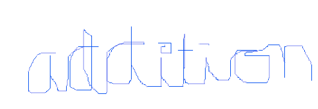

```{r, include = FALSE}
knitr::opts_chunk$set(
  collapse = TRUE,
  comment = "#>"
)
```

```{r setup}
devtools::load_all()
```

Addition (usually signified by the plus symbol +) is one of the four basic operations of arithmetic, the other three being subtraction, multiplication and division. The addition of two whole numbers results in the total amount or sum of those values combined. The example in the adjacent image shows a combination of three apples and two apples, making a total of five apples. This observation is equivalent to the mathematical expression "3 + 2 = 5" (that is, "3 plus 2 is equal to 5").

```{r}
add(1, 2)
```

```{r}
add(1, NA, na.rm = TRUE)
```


Besides counting items, addition can also be defined and executed without referring to concrete objects, using abstractions called numbers instead, such as integers, real numbers and complex numbers. Addition belongs to arithmetic, a branch of mathematics. In algebra, another area of mathematics, addition can also be performed on abstract objects such as vectors, matrices, subspaces and subgroups.

```{r}
x <- mtcars$wt
y <- mtcars$mpg
plot(x, y, main = "Here's a plot", xlab = "weight", ylab = "mpg",  pch = 19, frame = FALSE)
```

Addition has several important properties. It is commutative, meaning that order does not matter, and it is associative, meaning that when one adds more than two numbers, the order in which addition is performed does not matter (see Summation). Repeated addition of 1 is the same as counting; addition of 0 does not change a number. Addition also obeys predictable rules concerning related operations such as subtraction and multiplication.

```{r, fig.alt = "This figure does have alt text and so it's better"}

x <- mtcars$hp
y <- mtcars$mpg
plot(x, y, main = "Here's a plot", xlab = "horsepower", ylab = "mpg",  pch = 19, frame = FALSE)

```

Performing addition is one of the simplest numerical tasks. Addition of very small numbers is accessible to toddlers; the most basic task, 1 + 1, can be performed by infants as young as five months, and even some members of other animal species. In primary education, students are taught to add numbers in the decimal system, starting with single digits and progressively tackling more difficult problems. Mechanical aids range from the ancient abacus to the modern computer, where research on the most efficient implementations of addition continues to this day. 

# The same image, twice



```{r, fig.alt = "The trick is to include the alt text up here", out.width="25%"}

```
